<p align="center">
  
</p>

<h1 align="center">SmartSeat</h1>

<p align="center">
Modern Examination Seating Management System for Educational Institutions
</p>

<p align="center">


## 📖 Overview

SmartSeat is a web-based examination seating management system developed to simplify the process of creating examination seating arrangements in colleges and educational institutions.

The system enables teachers to manage students, rooms, examinations, and automatically generate seating plans while allowing students to quickly locate their examination seat using their register number.

---

## ✨ Features

- Secure Teacher Login
- Teacher Dashboard
- Student Management
- Room Management
- Examination Management
- Nominal Roll
- Automatic Seating Generation
- Reports
- Student Seat Search
- Responsive Design

---

## 🛠️ Tech Stack

### Frontend

- HTML5
- CSS3
- JavaScript
- Bootstrap
- SweetAlert2

### Backend

- Node.js
- Express.js

### Current Storage

- LocalStorage

---

## 🚀 Future Roadmap

### Version 1.0.0
- Teacher Portal
- Student Seat Search
- Seating Generator
- Reports

### Version 2.0.0
- MySQL Database
- Authentication
- QR Code Hall Tickets
- PDF Export

### Version 3.0.0
- Multi-College SaaS Platform
- Subscription System
- Analytics Dashboard

### Version 4.0.0
- Android App
- iOS App
- Push Notifications

---

## 📷 Screenshots

### Landing Page

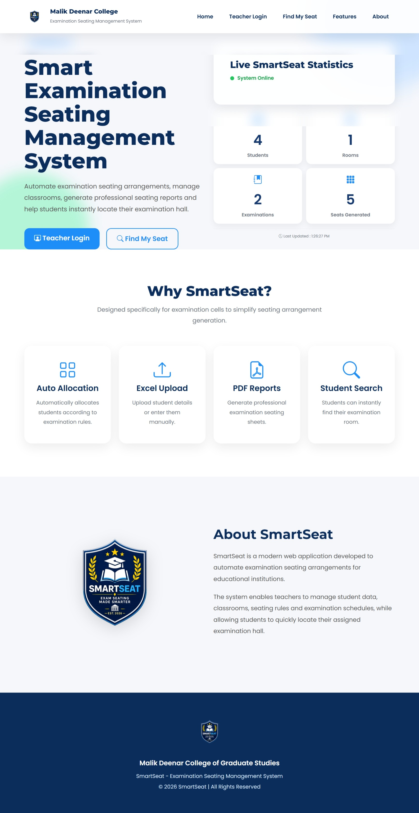

---

### Teacher Login

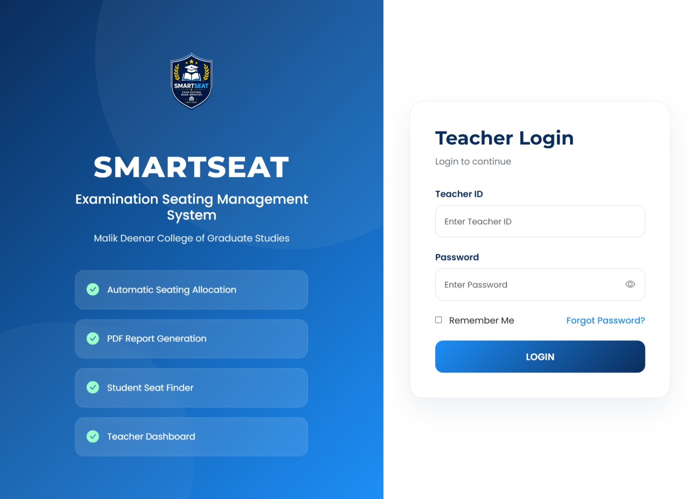

---

### Dashboard

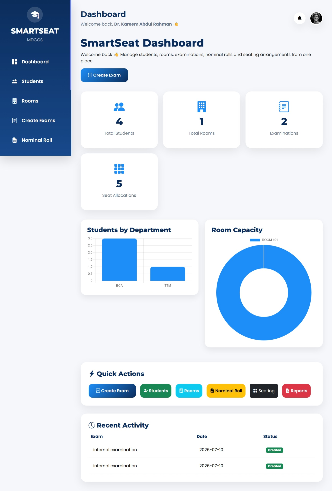

---

### Student Management

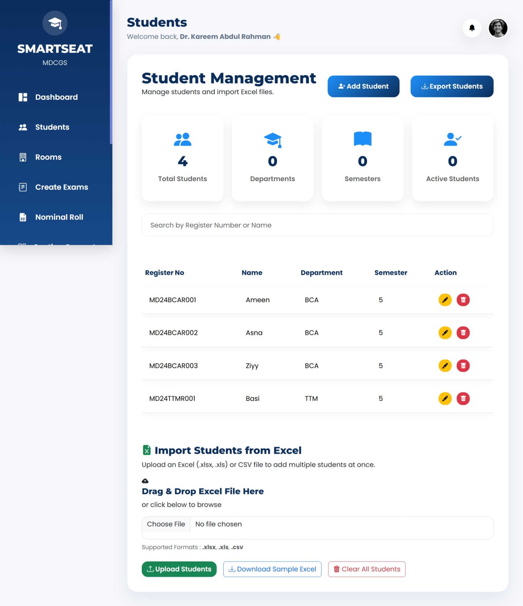

---

### Room Management

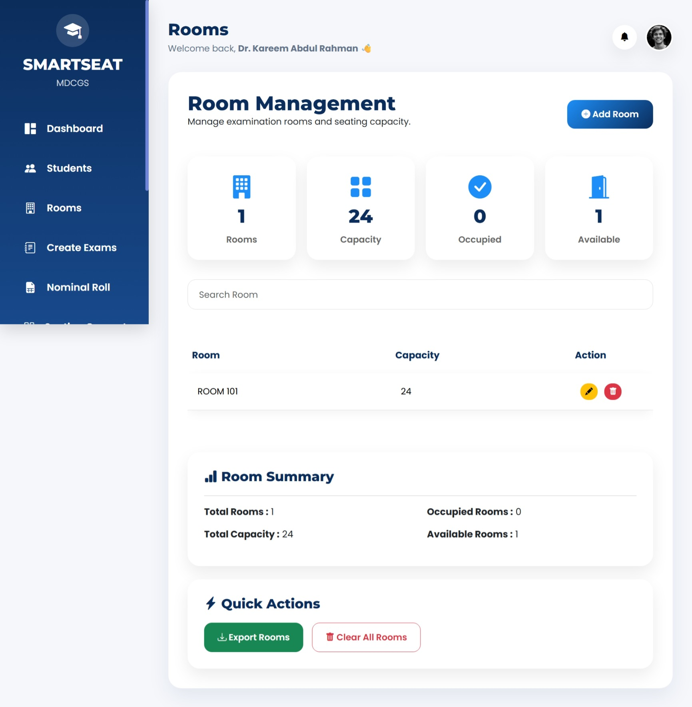

---

### Examination Management

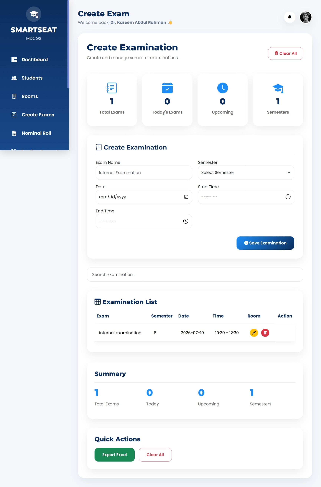

---

### Nominal Roll

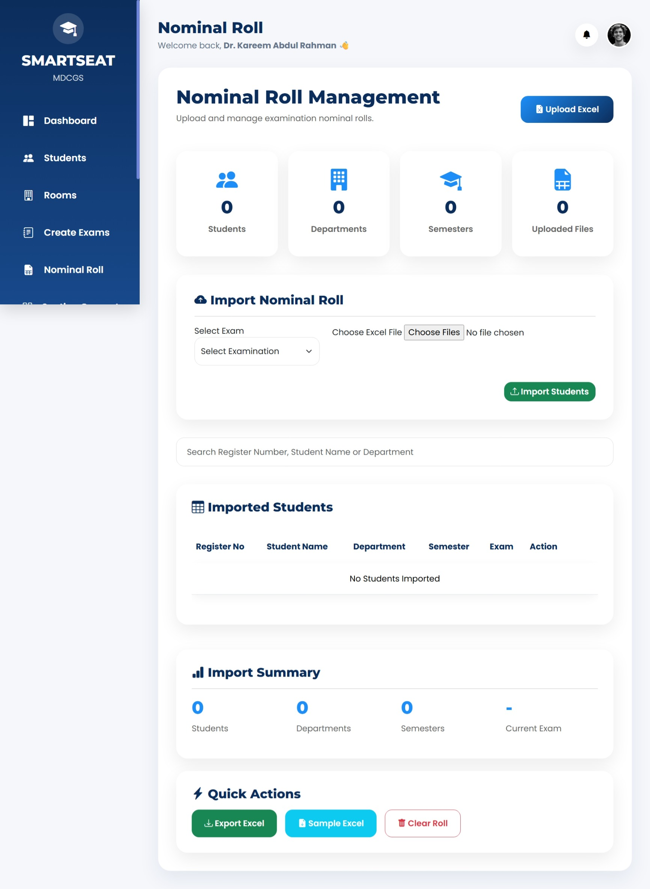

---

### Seating Generator


---

### Reports

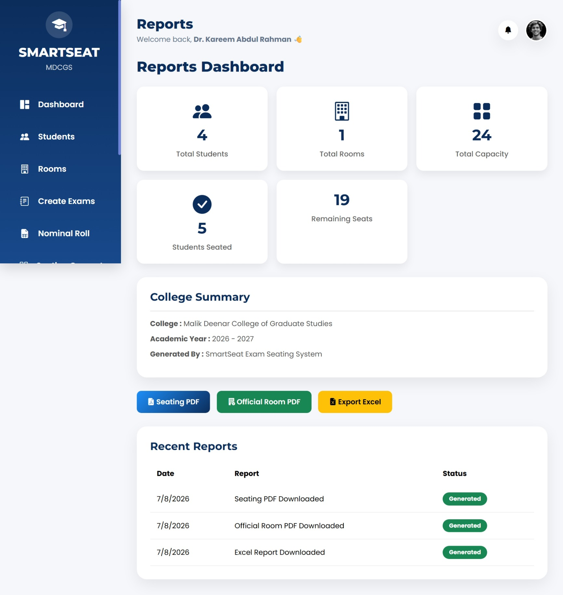

---

### Find My Seat

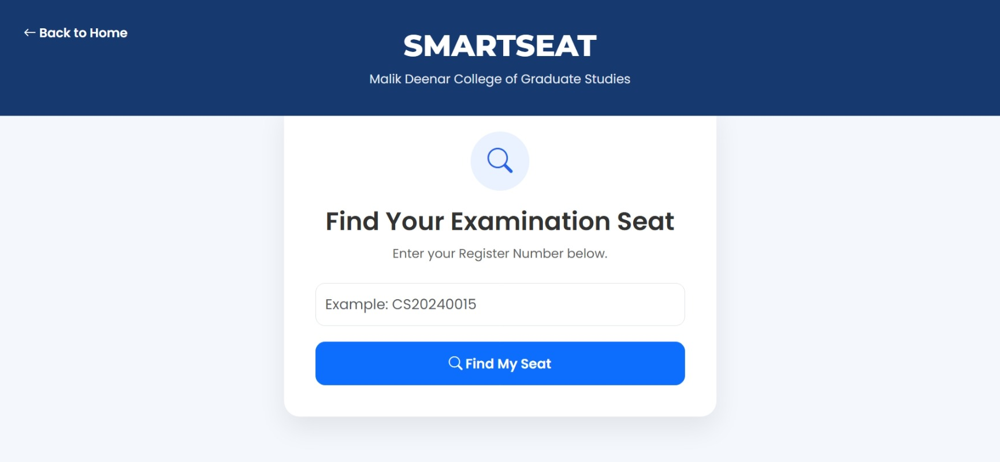

---

### Teacher Profile

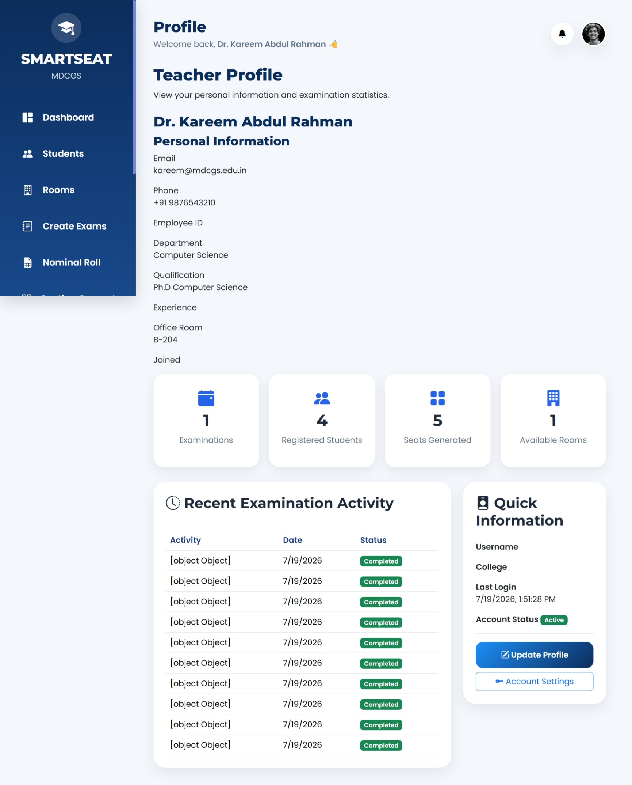

---

### Account Settings

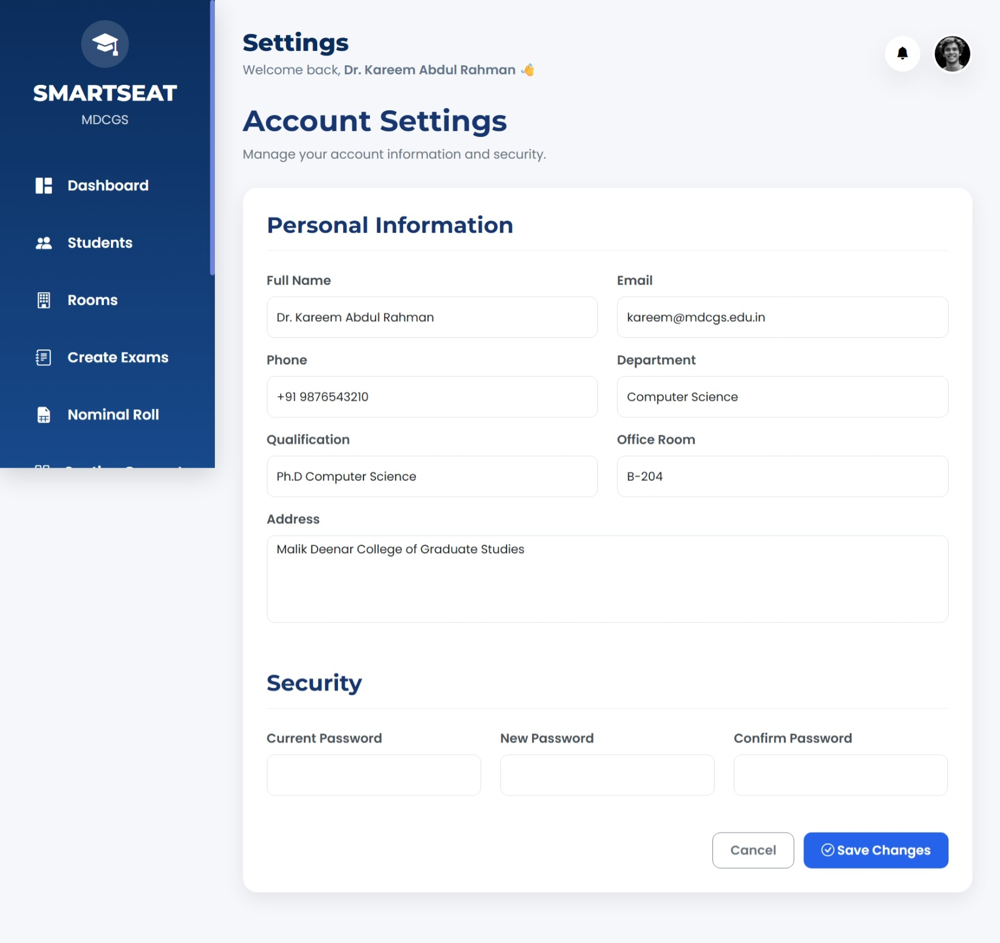

## ⚙️ Installation

Clone the repository

```bash
git clone https://github.com/AyshaMoideen/smartseat.git
```

Install dependencies

```bash
npm install
```

Run the project

```bash
npm start
```

---

## 👨‍💻 Developer

**Aysha Afnan Moideen**

Founder & Developer of SmartSeat | III BCA

GitHub: https://github.com/AyshaMoideen
